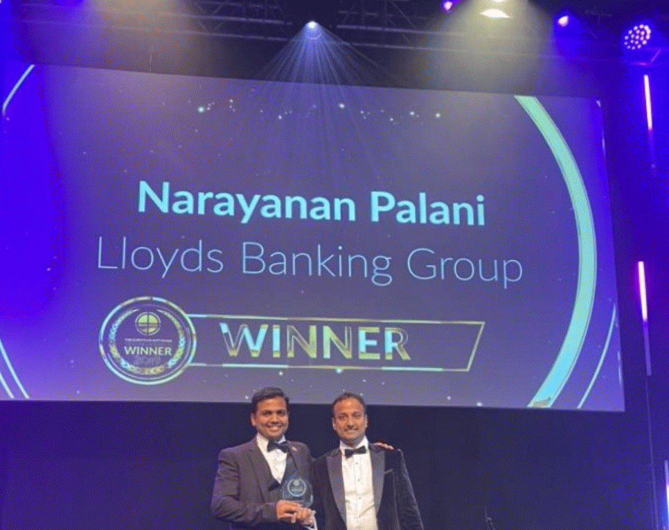

<!-- README.html — Paste into README.md on GitHub (GitHub accepts HTML in Markdown) -->

<!---- Header ---->
<h1 align="center">👋 Hello — I am Narayanan Palani</h1>

Platform Engineering Lead — London, United Kingdom 🇬🇧

<!-- Intro / Short bio (from uploaded CV) -->
<section>
  

    🔭 I am an <strong>Engineering Leader</strong> with over <strong>16+ years</strong> of experience, having led teams that made a positive impact across <strong>26M+ customers</strong> in Retail Banking covering International Payments, Customer Onboarding & Authentication, Credit Cards, Pensions, as well as Commercial Banking, SMEs and Investment Banking. :contentReference[oaicite:1]{index=1}
  

  

    🔭 Career highlights include building accessible technology for banking apps and websites, delivering seamless international money transfers, cloud transformation of legacy user journeys to Google Cloud, delivering vital COVID changes to commercial customers, digital enablement of Scottish Widows pensions, enabling Mona credit cards for secure internet banking, and leading platforms that scale across international payments domains. I have helped grow FinTechs regionally and delivered multi-million dollar savings through strategic initiatives.
  

  

    🔭 I’m passionate about empowering software leaders to lead with empathy, shape culture, establish vision, encourage continuous growth, and optimise performance through radical candor — balancing delivery pragmatism, craftsmanship and people development.
  

</section>

<!-- Awards -->
<section>
  <h2>🏆 Awards & Recognition</h2>
  
✨ <strong>European Software Testing Awards</strong> — Best Test Manager of the Year (Title Winner)

  <!-- Example image (ensure file exists in images/) -->
  

    
  

</section>

<!-- Snapshot -->
<section>
  <h2>🔭 Quick Snapshot</h2>
  <ul>
    <li>📍 London, United Kingdom — <strong>Work eligibility:</strong> British National</li>
    <li>📞 Phone: 07476 049944</li>
    <li>✉️ Email: <a href="mailto:narayananp24@gmail.com">narayananp24@gmail.com</a></li>
    <li>🌱 Recipient of <em>Tier 1 Exceptional Talent</em> (endorsed by TechCity UK)</li>
  </ul>
</section>

<!-- Career summary (explicit citation to the uploaded file) -->
<section>
  <h2>💼 Career Summary</h2>
  

    I’ve led large-scale engineering teams across HSBC, Lloyds Banking Group, Thomson Reuters, US Bank* & K Bank — delivering cloud-native mobile & web applications, automation frameworks and platform engineering with hands-on cloud experience in AWS, GCP and Azure. My CV details hands-on technologies, domains and major deliverables. :contentReference[oaicite:2]{index=2}
  

  

    <strong>Core strengths:</strong> Engineering leadership, cloud transformation (AWS / GCP / Azure), CI/CD, microservices & API design, test automation (Cypress, Playwright, Selenium), accessibility-first delivery (WCAG), security & compliance (GDPR, PCI-DSS, PSD2), and data governance (Snowflake, BigQuery).
  

</section>

<!-- Professional experience -->
<section>
  <h2>🧾 Professional Experience (Selected)</h2>

  <article>
    <h3>🏦 HSBC — Platform Head of Engineering | Engineering Specialist</h3>
    
<strong>Jan 2024 – Present</strong> — London, England

    <h4>Leadership in Web & Mobile Development (Account Opening — Retail Banking)</h4>
    <ul>
      <li>Led architecture & implementation of retail bank account opening and product integrations using React, Next.js and TypeScript.</li>
      <li>Implemented automated testing frameworks (Playwright, Cypress, Appium) across AWS-hosted services to improve resilience and test coverage.</li>
    </ul>

    <h4>Security & Risk Management on AWS</h4>
    <ul>
      <li>Secured web & mobile apps using GuardDuty, Inspector, AWS WAF, AWS Config, Secrets Manager and KMS; integrated SAST/DAST/RASP tools into CI pipelines.</li>
    </ul>

    <h4>Cloud Platforms & Architecture (AWS)</h4>
    <ul>
      <li>Led cloud transformation and IaC with CloudFormation & Terraform; used Lambda, Elastic Beanstalk, ECS/Fargate, API Gateway and App Runner for scalable microservices.</li>
      <li>Managed CI/CD using CodeCommit, CodePipeline, CodeBuild and CodeDeploy.</li>
    </ul>

    <h4>Data Integrity & Governance</h4>
    <ul>
      <li>Enabled data classification, retention & Snowflake analytics; implemented DSAR handling, data dictionary and governance roles.</li>
    </ul>

    <h4>People & Collaboration</h4>
    <ul>
      <li>Managed diverse engineering teams across UK, EU & Asia; championed inclusive hiring and cross-functional collaboration with product & cloud teams.</li>
    </ul>

    

      <strong>Certifications (listed in CV):</strong> AWS Certified Associate Solutions Architect, Azure Certified Solution Architect, AWS Certified Developer Associate, AWS Certified Machine Learning Specialty, AWS Associate Data Engineer.
    

    <!-- Credly images — GitHub doesn't support Credly scripts. Use repo-hosted images and link to public pages -->
    

      
      
    

  </article>

  

  <article>
    <h3>💳 Lloyds Banking Group — Platform Engineering Lead</h3>
    
<strong>Jan 2021 – Jan 2024</strong> — London, England

    

      Directed GCP & AWS migrations for onboarding, international payments and commercial servicing platforms. Built real-time transaction monitoring pipelines (Pub/Sub, Dataflow), integrated Apigee for API management and applied security automation using SonarQube, Burp Suite and GCP Security Command Center.
    

    
<strong>Certifications (from CV):</strong> Google Cloud Certified Machine Learning Engineer, Google Professional Cloud Architect, Google Certified Security, Google DevOps Certified.

  </article>

  

  <article>
    <h3>🏛 Lloyds Banking Group — Chapter Lead (Commercial & Consumer)</h3>
    
<strong>2017 – 2021</strong>

    

      Led cloud transformations, payments hubs and regulatory deliveries (CoP, PCI-DSS) using Azure & AWS. Delivered test automation frameworks, accessibility testing, and vulnerability remediation programs across cards, pensions and onboarding products.
    

  </article>

  

  <article>
    <h3>💹 Thomson Reuters — Lead Engineer (FX / Trading Systems)</h3>
    
<strong>Jun 2015 – Mar 2017</strong>

    
Built automation for electronic trading platforms, integrated FIX/Murex workflows and led compliance-driven testing for FX platforms.

  </article>

  

  <article>
    <h3>🏛 Wipro / US Bank / K Bank — Team Lead</h3>
    
<strong>Sep 2007 – Nov 2011</strong>

    
Delivered internet banking, credit-card onboarding and end-to-end testing for global bank clients; led vulnerability testing, KYC/AML compliance checks and test automation efforts.

  </article>
</section>

<!-- Areas of expertise / Tech stack -->
<section>
  <h2>🛠 Areas of Expertise & Technologies</h2>
  
<strong>Expertise:</strong> Engineering Leadership, Technical Strategy, Cloud Architecture, DevOps, CI/CD, Test Automation, Accessibility, Security & Compliance, Data Governance, Team Building, Mentorship.

  
<strong>Technologies & Tools:</strong> Java, JavaScript, TypeScript, React, Next.js, Spring Boot, Python, .NET, AWS (Lambda, EC2, S3, RDS, Aurora, ECS, EKS, CodePipeline), GCP (GKE, BigQuery, Pub/Sub), Azure (AKS, Functions), Terraform, CloudFormation, Kubernetes, Playwright, Cypress, Selenium, JMeter, Burp Suite, SonarQube, Snowflake.

  
<strong>Domains:</strong> Faster Payments, SWIFT, SEPA, ACH, PSD2, Open Banking, ISO 20022, PCI DSS, Cards, Pensions, Commercial Banking, Retail Banking.

</section>

<!-- Publications / Books -->
<section>
  <h2>📚 Publications & Books</h2>

  

    

      <h4>The Web Accessibility Project — Development and Testing Best Practices</h4>
      
    

    

      <h4>Automated Software Testing with Cypress</h4>
      
    

  

</section>

<!-- Certifications -->
<section>
  <h2>🎖 Certifications</h2>

  
Certifications listed in my CV include (as written):

  <ul>
    <li>AWS Certified Associate Solution Architect</li>
    <li>AZURE Certified Solution Architect</li>
    <li>AWS Certified Developer Associate</li>
    <li>AWS Certified in Machine Learning Specialty</li>
    <li>AWS Certified Associate Data Engineer</li>
    <li>Google Cloud Certified Machine Learning Engineer</li>
    <li>Google Professional Cloud Architect</li>
    <li>Google Certified Security</li>
    <li>Google DevOps Certified</li>
    <li>Azure Security Certified</li>
    <li>Scaled Agile Framework (Leading SAFe)</li>
    <li>DevOps Institute’s DevOps Certified</li>
    <li>ISQI/A4Q Selenium Certified</li>
    <li>ISTQB Advanced Test Manager</li>
    <li>ISTQB Advanced Test Automation Engineer</li>
    <li>DevOps Institute’s DevSecOps Certified</li>
    <li>Microsoft Certified Professional, Visual Studio Certified, GAQM Certified Scrum Master</li>
    <li>PRINCE2 Project Management Certified, ITIL Certified</li>
  </ul>

  

  

    <!-- AWS Certifications -->
    

    

    

    

    <!-- Azure Certifications -->
    

    

    <!-- Google Cloud Certifications -->
    

    

    

    

    <!-- DevOps / Agile / Testing -->
    

    

    

    <!-- Management & ITIL -->
    

    
  

  
<em>Tip:</em> Upload each official badge image (PNG/SVG) to <code>images/certifications/</code> and update the filenames if needed. Link each image to its verification page for trustable proof.

</section>

<!-- Education -->
<section>
  <h2>🎓 Education & Professional Development</h2>
  <ul>
    <li>Certificate of Specialization — Leadership and Management (Harvard Business School Online)</li>
    <li>Certificate — Lloyds Bank Sustainability Leadership Program (Exeter Business School)</li>
    <li>Certificate of Specialization — Fintech: Foundations & Applications of Financial Technology (Wharton Online)</li>
    <li>Certificate — Leading Digital Transformation (IIM Ahmedabad)</li>
    <li>MSc — Software Engineering (Birla Institute of Technology and Science, Pilani)</li>
    <li>PG Diploma Executive — Management (K. J. Somaiya Institute of Management Science and Research, Mumbai)</li>
  </ul>
</section>

<!-- Open source & contact -->
<section>
  <h2>🧩 Open Source & Contact</h2>
  
I publish open-source projects and testing resources for developers and QA — please fork and contribute.

  <ul>
    <li>GitHub: <a href="https://github.com/narayananpalani" target="_blank" rel="noopener">github.com/narayananpalani</a></li>
    <li>LinkedIn: <a href="https://linkedin.com/comm/mynetwork/discovery-see-all?usecase=PEOPLE_FOLLOWS&followMember=narayananpalani" target="_blank" rel="noopener">Follow on LinkedIn</a></li>
    <li>Email: <a href="mailto:narayananp24@gmail.com">narayananp24@gmail.com</a></li>
  </ul>
</section>

<em>“Empowering software leaders to build, scale and lead with empathy.”</em>

# LATEST BOOKS ON CODE DEVELOPMENT

# LATEST BOOKS ON AUTOMATION

<!--
**narayananpalani/narayananpalani** is a ✨ _special_ ✨ repository because its `README.md` (this file) appears on your GitHub profile.

Here are some ideas to get you started:

- 🔭 I’m currently working on ...
- 🌱 I’m currently learning ...
- 👯 I’m looking to collaborate on ...
- 🤔 I’m looking for help with ...
- 💬 Ask me about ...
- 📫 How to reach me: ...
- 😄 Pronouns: ...
- ⚡ Fun fact: ...
-->
